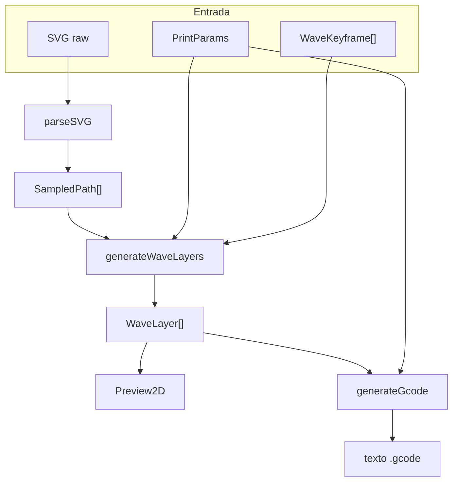
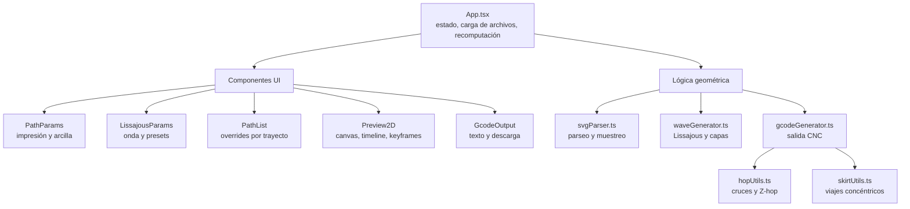
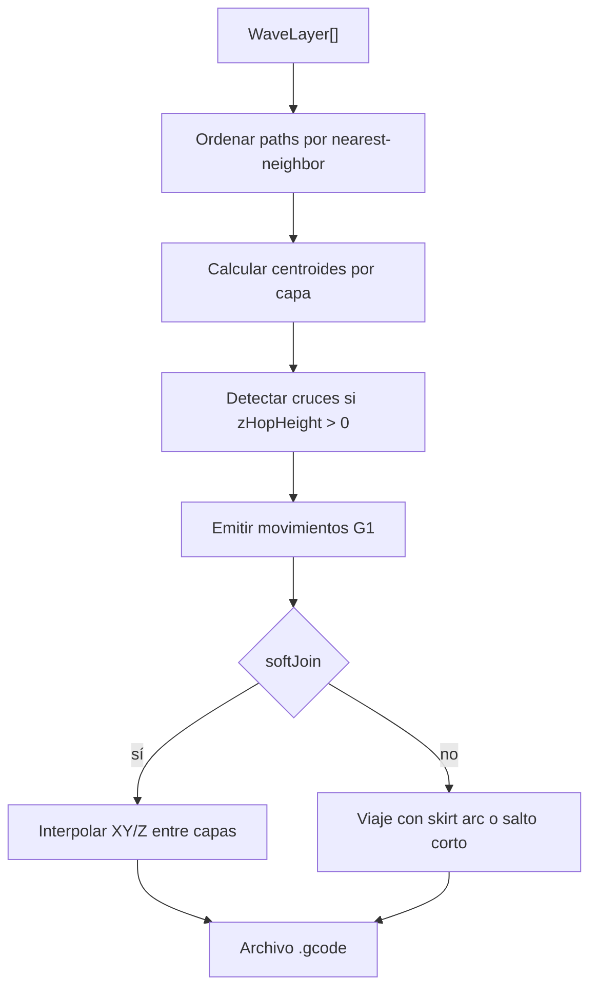

# Arquitectura

BarroCode está organizado como una app React/Vite con lógica geométrica en `src/lib` y componentes de interacción en `src/components`.

## Pipeline



## Responsabilidades



## SVG Parser

`svgParser.ts` usa `DOMParser` y luego inserta el SVG en un contenedor oculto. Esto permite usar `SVGGeometryElement.getTotalLength()` y `getPointAtLength()` del navegador.

El muestreo produce `SampledPoint`:

```text
x, y
tangentX, tangentY
normalX, normalY
arcLength
```

La tangente se calcula con diferencias finitas y la normal se deriva rotando la tangente 90 grados.

## Generador De Onda

`waveGenerator.ts` evalúa una figura de Lissajous en el marco local del extrusor:

```text
phaseN = 2π * s / wlN + delta + phaseBase
phaseT = 2π * s / wlT + phaseBase
offsetN = ampN * sin(phaseN)
offsetT = ampT * sin(phaseT)
point = centerline + normal * offsetN + tangent * offsetT
```

También aplica:

- dirección alternada por capa;
- cierre opcional de trayectos;
- interpolación de keyframes;
- centro y escala por keyframe;
- conversión de SVG a mm mediante `svgToMM`.

## Generador De G-code

`gcodeGenerator.ts` recibe `WaveLayer[]` y produce G-code textual.



El modelo de extrusión es lineal:

```text
E += distancia * extrusionMultiplier
```

Si `generateE` está desactivado, la salida conserva movimientos pero omite la columna `E`.

## Vista Canvas

`Preview2D.tsx` dibuja una proyección ortográfica 3D en Canvas. La escala, rotación, pan y keyframes viven en estado local del componente, mientras las capas generadas llegan desde `App.tsx`.

La vista muestra:

- grilla base;
- capas coloreadas;
- línea de centro/escala;
- keyframes;
- posición virtual del extrusor;
- viajes entre trayectos;
- cubo de orientación.
