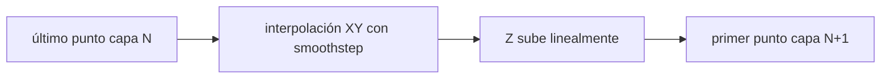
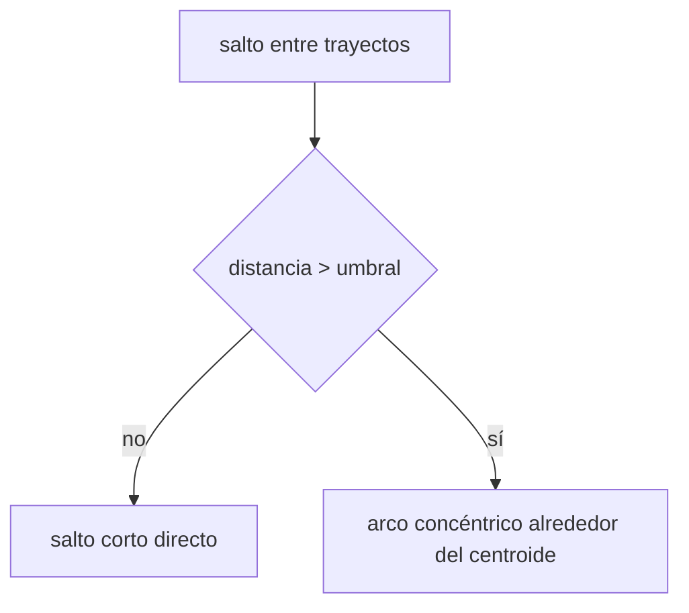

# Notas De Fabricación

BarroCode está orientado a impresión por deposición líquida, especialmente arcilla. Varias decisiones de G-code y UI responden a ese contexto.

## Principios

- Mantener flujo continuo cuando sea posible.
- Evitar retracciones como mecanismo principal de control.
- Reducir viajes rectos largos sobre material recién depositado.
- Hacer visibles las transiciones entre capas antes de exportar.
- Permitir calibración manual de escala, origen, altura de boquilla y extrusión.

## Transición Suave Entre Capas

Cuando `softJoin` está activo, BarroCode conecta el final de una capa con el inicio de la siguiente mediante interpolación:



Esto evita cortar el flujo y puede producir una pared más continua en arcilla.

## Z-hop En Cruces

Si `zHopHeight > 0`, el sistema detecta cruces de trayectoria dentro de la capa y levanta la boquilla suavemente alrededor de esos puntos.

El objetivo no es detener la extrusión, sino despejar un cruce mientras el material sigue fluyendo.

## Viajes Concéntricos

Cuando no se usa soft join, los desplazamientos largos pueden reemplazarse por arcos alrededor del centroide de la capa. Esto reduce cruces directos por el interior de la pieza.



## Escala Y Unidades

El SVG no necesariamente está en mm. Ajusta `scaleFactor` según el archivo:

- `1`: SVG ya dibujado en mm.
- `0.2645`: aproximación de px a mm para 96 dpi.

Siempre conviene verificar dimensiones reales antes de imprimir.

## Extrusión

El modelo actual es lineal:

```text
E += distancia * multiplicador
```

Esto es suficiente para muchas bombas de arcilla o sistemas de tornillo sin fin, pero cada máquina requiere calibración. Usa velocidades bajas al validar una geometría nueva.
